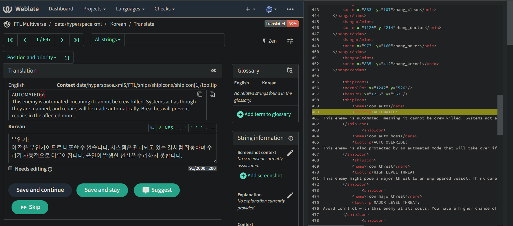

# weblate-sourceview-userscript

Userscript for Weblate SourceView to be used with FTL: Multiverse Translation Project.

## Installation

1. Get a userscript manager (e.g., ~greasemonkey~, tampermonkey, violentmonkey).

   Note: This script is not compatible with greasemonkey 4.x. If you are on Firefox, please use violentmonkey instead.
3. [Click this link](https://github.com/ftl-mv-translation/weblate-sourceview-userscript/raw/main/weblate-sourceview.user.js) to install the script.

## Usage

A translation page automatically shows the original source lines in the right-sided panel:

